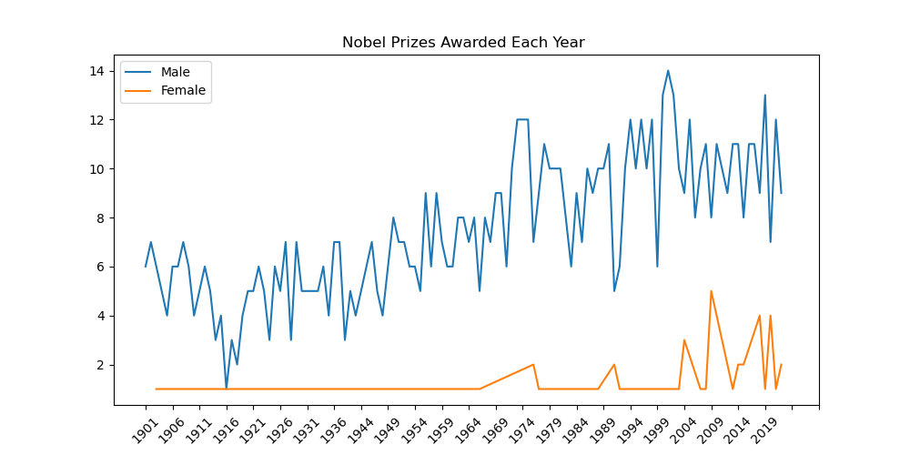

# 
 Is The Norwegian Nobel Committee Biased? 
## 
  Analyzing Nobel Prize Winners 
### 
 (1901-2022)
  

#### Hypothesis I: Women have been discriminated against historically and therefore, will be underrepresented among Nobel Prize laureates. 
#### Hypothesis II: The women who have been awarded the Nobel Prize are most represented in the categories of Peace and Literature due to suppression in other fields. 
  

 Nobel Prizes Awarded Per Category

 Female laureates are most often awarded for work in Literature and Peace, while males are more often awarded for Medicine, Chemistry, and Physics. 

  

#### We can explore the individual laureates here: 
[Female Laureates](./images/FemaleLaureates.html)
 

[Male Laureates](./images/MaleLaureates.html)
   

##### What exactly is the disparity between Male and Female Laureates? 

  

###### basically, 
# YES
  

###### Hypothesis III: Women are underrepresented in Nobel Prize Categories because they are discriminated against in the workforce. 

######GDI: measures the gender gap in human development achievements by accounting for disparities between women and men in 3 parameters of human development (HDI): longevity, knowledge, and standard of living. The ratio is calculated as female HDI to male HDI, with 5 being the lowest and 1 being the highest. 

#### Even in countries where the Gender Development Index is highest, women only make up to 40% the salary of male counterparts. 
##### 

  

## It must be more inclusive now though, right? 
  
  

###### (emphasis on "more"...)
  

  

"But women do have equality in developed countries!"

### The top 10 Nobel Winning Countries also have the highest Gender Development Indexes
###### (even Norway has a GDI of 1)
##### So, why haven't they awarded more women?

# Today, only 60 women have won in 120 years. 894 men have been awarded. 

## Women comprise of 6.3% of all Nobel Prize Winners, mainly in the categories of Literature and Peace. 

